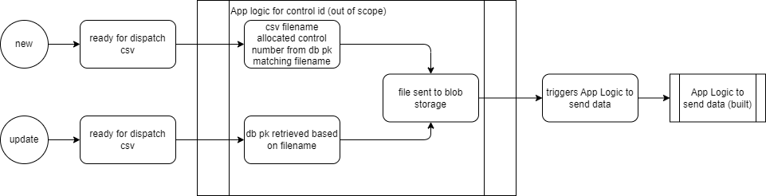

# Sanford3PL

The focus of the code is to showcase use of logic app to send JSON paylod from D365 to 3PL
The workflow is showcased on the above flowchart.

Assumptions:
Assuming the csv files are generated by D365.
In order to track control ids against specific files, this will need to be recorded in some storage like a database to map it to avoid duplicate control ids for the same file. Due to time shortage this was placed as out of scope and was considered done outside of the logic app

The app logic:
It is in json format and can be deployed to Azure by Azure devops
Azure API Management can be used for securing the logic app and using its "Restrict caller IPs" policy should help resticiting access

